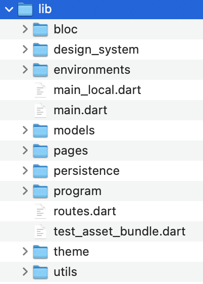

# Issues of a growing codebase

## It started well

Back when we started the app, we naively started with the simplest thing that worked. While working on the first few features of the app, we came up with the "typical" building blocks for our app, which we neatly organized in folders. 

We came up overall with this sort of structure : 

You don't need to know much about it, but roughly, we ended up with : 
- `bloc` - contains *BLoC*s , which are the classes through which we expose use cases (somethimes called *Application Services*)
- `design_system` - generic `Widget`s that we re-use across the app for a consistent UX
- `models` - simple classes that we pass around
- `pages` - the actual top-level pages of the app (we navigate from one page to another through *routing*)
- `persistence` - all the necessary infrastructure to store user progress in the phone's database
- `program` - the contents of the program the patients go through
- `theme` - a centralized place for the app's look and feel (colors, fonts etc)
- `utils` - little helper functions

And a few top-level files
- `main.dart` - the entry point of the app
- `routes.dart` - the routing for the app, for navigation between pages

