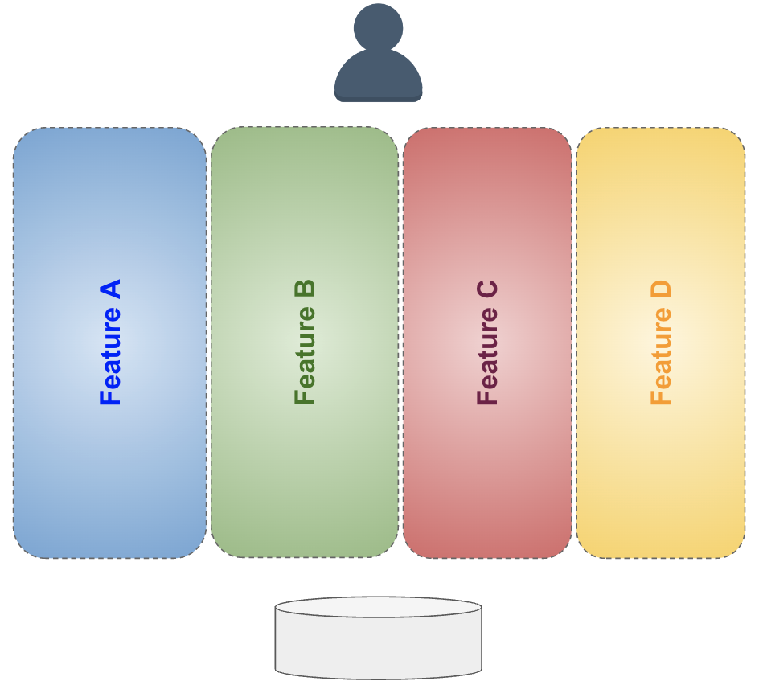

# Issues of a growing codebase

## It started well

Back when we started the app, we naively started with the simplest thing that worked. While working on the first few features of the app, we came up with the "typical" building blocks for our app, which we neatly organized in folders.

While working during the first months of the project, we came up overall with this sort of structure :

You don't need to know much about it, but roughly, we ended up with :

- `bloc` - contains *BLoC*s , which are the classes through which we expose use cases (somethimes called _Application Services_)
- `design_system` - generic `Widget`s that we re-use across the app for a consistent UX
- `environments` - top level configuration to have slightly different behavior depending on the destination of the app (local build vs testing vs official Prod build)
- `models` - simple classes that we pass around
- `pages` - the actual top-level pages of the app (we navigate from one page to another through _routing_)
- `persistence` - all the necessary infrastructure to store user progress in the phone's database
- `program` - the contents of the program the patients go through
- `theme` - a centralized place for the app's look and feel (colors, fonts etc)
- `utils` - little helper functions

And a few top-level files

- `main.dart` - the entry point of the app
- `routes.dart` - the routing for the app, for navigation between pages

## An implicit layered architecture

In a way, what we created was a layered architecture, where we clearly and physically separated :

- Presentation
- Business Logic
- Data

TODO: a diagram with the layers , and folder mapping to the layers

A Layered architecture is quite a classical way of designing systems, and is not a bad thing ("Lasagna code is better than Spaghetti code"), and there are some benefits to be gained from using it :

- It enforces _"Separation of Concerns"_ : by having different folder, you are somehow forced to "split" your feature in UI vs Data vs Logic.
- This helps with testing (you can theoretically have automated tests for your feature without interacting with the UI), this can also help spreading the work if that's what you want
- The rules to follow are fairly simple and it's easy to learn

## A growing system

As we kept working on the app, the codebase grew, and it became harder to work efficiently in there.

### Cognitive load and friction

While initially we had less than 10 files in each of our main folder, this quickly grew.

TODO: How it started / How it was going (some items in a folder / many items in folder)

Just opening one of those folders became a little bit stressful.

They say the number of objects an average human can hold in short-term memory is 7 ± 2.
TODO : source

We went way past it.

By having more files in those folders, there's a lot of **friction** when navigating the codebase. Finding a file gets harder as it gets lost in a bucket full of other unrelated files.

### Feature spread

Typical work in the app is **feature** work, such as adding a new functionality, or enhancing an existing functionality. You rarely need to work on more than one functionality at once (and if you need to, then are they really distinct functionalities ?).

When talking about a "feature" what I mean is the parts of the app that provide a given capability to some users of the system. Typically a feature is made of :

- some sort of UI that user can see
- some rules that dictate what happens when user interacts with the system.
- some sort of persistence mechanism, so that the effects of user actions are not lost when quitting the app

Those parts are naturally connected, and a typical "data flow" would look like this:

- user _interacts with_ UI
- UI _triggers_ some action from Business Logic
- new state is _stored_ in persistence
- changes of state _are reflected in_ UI

TODO : show a feature with user, database, relations between them etc

With our high level folders, this is what we get :

TODO : feature mapping - add colors to files that belong to the same feature

Here, I have painted in the same colour different files that belong to the same feature.

This quickly reveals 2 problems :

- code for a given feature **is spread across folders**. There is no obvious explicit connection between those files, but you'd end up discovering they are connected by following the `import` statements, or simply because their name somehow relates to the same concepts.
- in a given folder you find lots unrelated files that have very little in common.

In the Software world, here, we would be talking about "low cohesion" across our folders.
TODO: go further about cohesion ?

TODO: something about the mismatch of App Structure ("mental model", app glues together features) and code structure.

The structure is more based on "aesthetics" ("it feels nice that all the data stuff is here") than on how practical it is to use (access patterns).

TODO: picture of Lego grouped by color
TODO: picture of Lego grouped by types

## Another approach

TODO: picture of lego grouped by "model" we want to build

Some observations here :

- way more boxes, but less stuff in each box
- grouping has name ("the parts of the Fire-brigade truck")
- in each box, mixed together are different types/colors of elements and that's fine

The difference is this approach is that we are no longer grouping based on "what this thing is" or "what it looks like", we are grouping them by "what they are for".
We are grouping by "purpose".

If we try something similar in the software world, we are talking about grouping not by type (this is a UI widget, or this is a service, or this is a data-access class) but by features (this is used in the onboarding, this is used in the "chat" feature).

By doing so we are moving from **Layers** ...

... to **Slices**

Inside a given slice, you'll still find some elements that belong to your traditional layers (UI, data etc), but this becomes an "implementation detail" of each feature.

## Moving toward Slices with Feature folders

So in order to to help with maintaining the codebase, we decided to give a try to using slices, and to do this we started introducing **_"Feature folders"_**.

At the root of the project we created a new `features` folder. The idea is that within that folder, we'll create a folder for each major feature of the app, and put ALL the parts that are only needed for this feature in there.

Initially, when we started with that "re-organization" project, we went little by little, and the overall (very) manual process looked like this :

1. take a look at one of our bloated folders, and pick a file here
2. does it feel like this file supports a particular feature ?
   1. NO -> go back to 1. with another file
   2. YES -> continue
3. create a folder `features/<NEW_FEATURE>`
4. move the file there
5. look around the codebase for files that also belong to that feature, and also move them to `features/<NEW_FEATURE>`. Some typical suspects :
   1. files with a similar name (referring to similar concept)
   2. files that are `import`ed by the file we just moved
   3. files that `import` the file we just moved
6. Repeat 5. until it's enough
7. commit / push / merge
8. Take a well deserved break and go back to 1.

This is pretty manual, and it doesn't need to be perfect. At this point, what we really want is :

- remove as much as possible from our bloated folders
- see the list of features emerge little by little

When we did this on our codebase, what really became more appearant is that **not all features are alike**.

- some feature folders ended up with a lots of files, and other had few
- some features have no real UI
- some features have no persistence

and that's fine !

For feature folders that grew a bit too much, we added some subfolders to help navigating, but really only when we felt it became uncomfortable. The grouping is a bit arbitrary ... sometimes we defined some sort of "sub-feature", sometimes just distinguishing "top-level pages" from widgets used across the feature.

One of the nice things of having those "little isolated" folders is that their internal structure just becomes ad-hoc to support it, rather than trying to conform/comply with "THE ARCHITECTURE OF THE APP THAT YOU MUST FOLLOW OR ELSE...".
