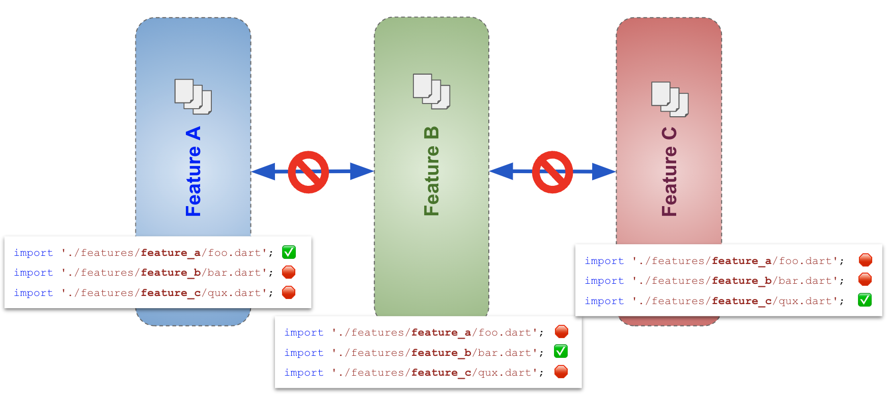

# Going further with feature isolation

Once we we set with our basic folder structure, we started to dig a little bit deeper.

While our initial "division" felt about right, taking a closer look revealed a few suprises... We noticed in a few places something like this :

```dart
// contents of file 'lib/features/backup/backup_upload_bloc.dart'
import 'package:mindset_depression/features/auth/tenant_config_state.dart';
```

What you can see here is :

- a file under feature **_X_** (here `backup`) ...
- ... importing a file from feature **_Y_** (here `auth`)

This is not the end of the world, but this came as a surprise. When we moved files around to group them by feature, our assumption was that our features were properly isolated from each other ... and it turns out they weren't. Moving actually **made the dependency more apparent**.

## Why should I care about feature isolation ?

We want our feature code to be isolated from other features... but why ?

Feature code is the code that supports the use cases of a functionality. This can include for instance pages, individual widgets, `BLoC`s to support the possible use cases, interaction with the backend-counterpart of the functionlity, types that we pass around as part of the functionality.

What we'd like is to be able to move as quickly (or more!) on our 10th feature as we did on the very first one. We want to make it available as soon as possible so our users can try it and we can start gathering feedback. Once the codebase reaches a certain size, this is not so easy, whenever you introduce changes you need to think hard about where the new code goes, how it fits with the existing one. All those micro-decisions slow you down, and it get worse over time.

By more strongly separating features, you get a developer experience closer to a fresh new app. Each feature folder is like a sandbox, if you break something, it will only impact that feature, not the other ones.

By focusing on the particular use cases of your feature, you also end up writing simpler code, just the minimum that is required to support that feature. At least initially there is no point in making it more generic than it needs to be.

## Detecting feature coupling

When looking at our import statements in the previous example, we detected "feature coupling", and as a general rule of thumb, this is what we want to avoid.

We initially detected manually through exploration and inspection, but it would be nice to automate it so we can :

- fix it in the current state of our codebase
- prevent it from happening again during future developements

TODO: a bit about relying on Automated Test to do self inspection and detect some drift / infractions

This translates to "forbidding" importing code of `feature_a` from code belonging to `feature_b`.



## Distinguishing between feature-specific and shared code

By clearly isolating feature code, you end up with a very clear delimitation of :

- code that belongs to a single feature
- code that is used in more than one place

This is a pretty useful distinction.

In code that belongs to a single feature, you can work freely, refactor without mercy, experiment, try new approaches with the confident that you are not breaking other features.

When you are touching shared code, you need to be more careful, as your changes can ripple.

For those reasons, you want to start in feature-specific code, and only if and when needed, "promote" it to shared code.

TODO: image of moving from specific to generic

---

High cohesion within a single feature / Low coupling between different features.

Something about shared code ? the part that becomes more generic over time...
